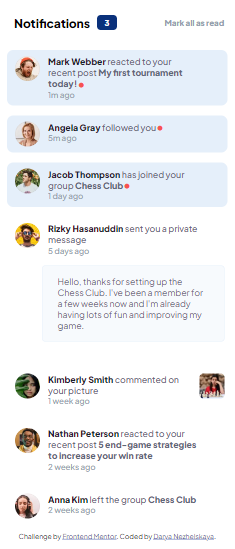
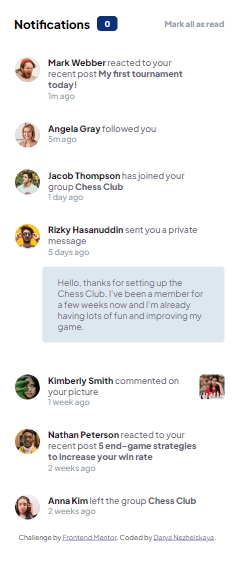
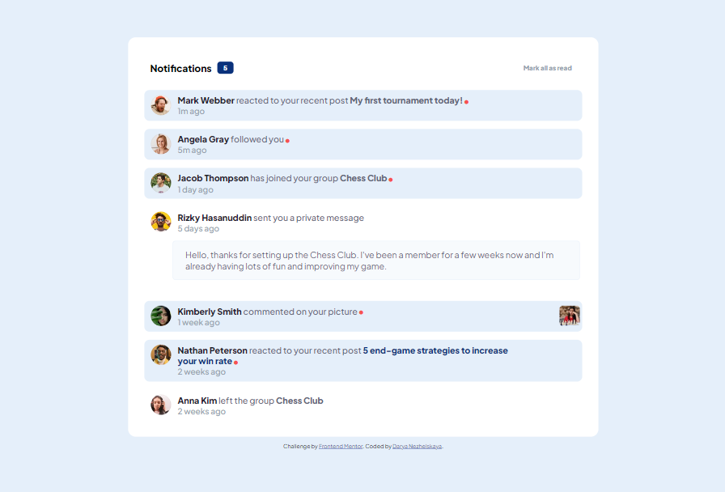

# Frontend Mentor - Notifications page solution

This is a solution to the [Notifications page challenge on Frontend Mentor](https://www.frontendmentor.io/challenges/notifications-page-DqK5QAmKbC). Frontend Mentor challenges help you improve your coding skills by building realistic projects.

## Table of contents

- [Overview](#overview)
  - [The challenge](#the-challenge)
  - [Screenshot](#screenshot)
- [My process](#my-process)
  - [Built with](#built-with)
  - [What I learned](#what-i-learned)
  - [Continued development](#continued-development)
- [Author](#author)

## Overview

### The challenge

Users should be able to:

- Distinguish between "unread" and "read" notifications
- Select "Mark all as read" to toggle the visual state of the unread notifications and set the number of unread messages to zero
- View the optimal layout for the interface depending on their device's screen size
- See hover and focus states for all interactive elements on the page

### Screenshot

  

## My process

I managed to count how many unread notifiations are really there, not just 3 as was required.

### Built with

- Semantic HTML5 markup
- CSS custom properties
- Flexbox
- Mobile-first workflow

### What I learned

I tried to use such a thing as aria-label for my button.

### Continued development

This challenge was not so difficult for me but there were some tricky moments and I will return to it later to think about connection between my dot-icons and background of unread notifications.

## Author

- Website - [Darya Nezhelskaya](https://github.com/tired-herb)
- Frontend Mentor - [@tired-herb](https://www.frontendmentor.io/profile/tired-herb)
